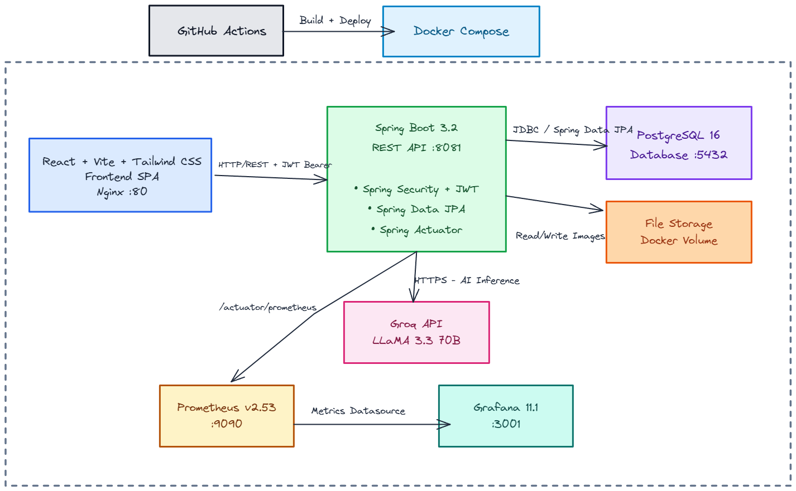
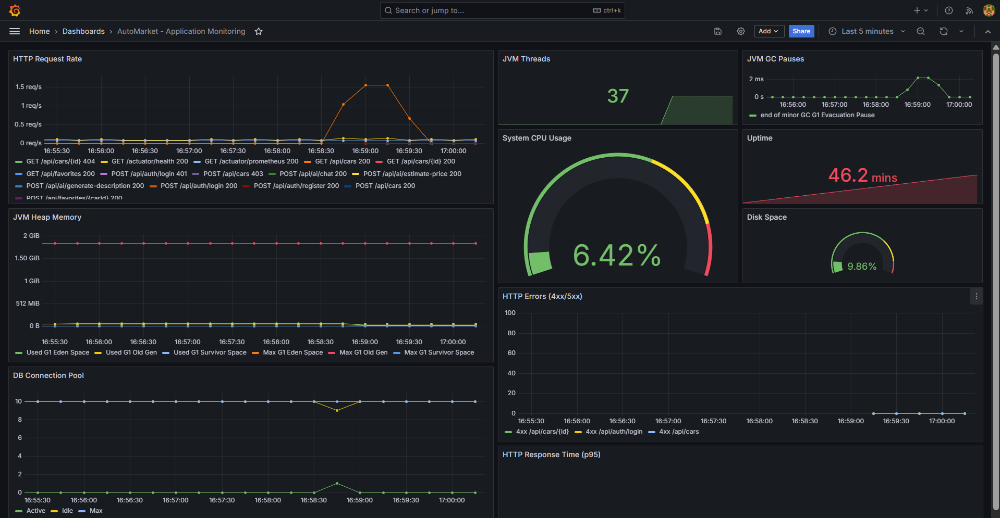
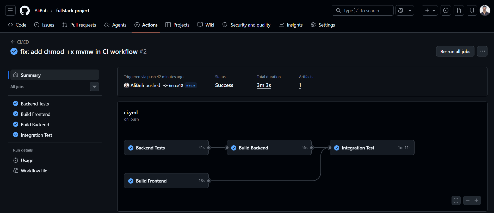

# AutoMarket

> AI-powered car marketplace platform for the Moroccan market.

Users can browse, publish, and manage car listings with intelligent features powered by Groq AI — including price estimation, natural language chat, and automated description generation.

---

## Table of Contents

- [Architecture](#architecture)
  - [System Design](#system-design)
  - [Functional Requirements](#functional-requirements)
- [Tech Stack](#tech-stack)
- [Getting Started](#getting-started)
- [Environment Variables](#environment-variables)
- [API Reference](#api-reference)
- [AI Features](#ai-features)
- [Monitoring](#monitoring)
- [Testing](#testing)
- [CI/CD](#cicd)
- [Project Structure](#project-structure)
- [Contributing](#contributing)

---

## Architecture

### System Design

The platform follows a microservices-oriented architecture with all components containerized via Docker Compose. The frontend communicates with the backend through REST APIs secured with JWT. AI features are powered by an external LLM provider (Groq), and the monitoring stack (Prometheus + Grafana) provides real-time observability.



### Functional Requirements

**Authentication**
- Register a new account (email, password, name, phone, city)
- Log in with email/password and receive a JWT token
- Persistent session via token stored client-side

**Car Listings**
- Browse all active listings (public, no auth required)
- Search and filter by brand, city, fuel type, price range, minimum year
- Paginated results (configurable page size)
- View full listing details including seller contact info
- Publish a new car listing with photo upload
- Edit own listing (update info, change photo)
- Delete own listing
- View all own published listings ("Mes Annonces")

**Favorites**
- Add any listing to personal favorites
- Remove a listing from favorites
- View all favorited listings
- Visual indicator (filled/empty heart) on listing detail

**Seller Contact**
- View seller's phone number on listing detail page
- Click-to-call link for mobile users

**AI Features (powered by Groq LLaMA 3.3 70B)**
- Estimate fair market price given car specifications
- Chat with AI assistant about cars, maintenance, Moroccan market
- Auto-generate professional listing description in French
- View personal AI interaction history

**Image Management**
- Upload car photos (JPG/PNG, max 5MB)
- Images persist across container restarts (Docker volume)
- Serve uploaded images publicly via API

---

## Tech Stack

| Layer | Technology | Version |
|-------|-----------|---------|
| Frontend | React + Vite + Tailwind CSS | 19 / 8 / 4 |
| Backend | Spring Boot + Spring Security + JPA | 3.2.5 |
| Database | PostgreSQL | 16.3 |
| AI | Groq API (LLaMA 3.3 70B Versatile) | — |
| Auth | JWT (stateless, BCrypt) | jjwt 0.12.5 |
| Monitoring | Prometheus + Grafana | v2.53 / 11.1 |
| CI/CD | GitHub Actions | — |
| Containers | Docker Compose | — |
| API Docs | SpringDoc OpenAPI (Swagger UI) | 2.5.0 |

---

## Getting Started

### Prerequisites

- Docker & Docker Compose
- Git

### Quick Start

```bash
git clone <repository-url>
cd fullstack-project

# Copy environment file
cp .env.example .env
# Edit .env with your Groq API key

# Start all services
docker compose up -d

# Wait ~30s for backend to initialize, then open:
# Frontend:   http://localhost
# Swagger UI: http://localhost:8081/swagger-ui.html
# Grafana:    http://localhost:3001 (admin/admin)
```

### Default Accounts

| Email | Password | Has Listings |
|-------|----------|:---:|
| ahmed@automarket.ma | password123 | ✓ (4 cars) |
| karim@automarket.ma | password123 | ✓ (4 cars) |
| omar@automarket.ma | password123 | ✓ (4 cars) |
| sara@automarket.ma | password123 | ✗ (fresh user) |

### Stopping

```bash
docker compose down       # Stop services (data persists)
docker compose down -v    # Stop + delete all data
```

---

## Environment Variables

| Variable | Description | Default |
|----------|-------------|---------|
| `POSTGRES_DB` | Database name | automarket |
| `POSTGRES_USER` | Database user | postgres |
| `POSTGRES_PASSWORD` | Database password | — |
| `JWT_SECRET` | JWT signing key (min 256 bits) | — |
| `GROQ_API_KEY` | Groq API key for AI features | — |
| `GF_SECURITY_ADMIN_PASSWORD` | Grafana admin password | admin |

---

## API Reference

Base URL: `http://localhost:8081`

Interactive docs: [http://localhost:8081/swagger-ui.html](http://localhost:8081/swagger-ui.html)

### Authentication

| Method | Endpoint | Description | Auth |
|--------|----------|-------------|:----:|
| POST | `/api/auth/register` | Create account | ✗ |
| POST | `/api/auth/login` | Get JWT token | ✗ |

### Cars

| Method | Endpoint | Description | Auth |
|--------|----------|-------------|:----:|
| GET | `/api/cars` | List/search cars (paginated, filterable) | ✗ |
| GET | `/api/cars/{id}` | Get car details | ✗ |
| POST | `/api/cars` | Create listing | ✓ |
| PUT | `/api/cars/{id}` | Update listing (owner only) | ✓ |
| DELETE | `/api/cars/{id}` | Delete listing (owner only) | ✓ |
| GET | `/api/cars/my` | Current user's listings | ✓ |

**Search parameters:** `marque`, `localisation`, `carburant`, `prixMin`, `prixMax`, `anneeMin`, `page`, `size`

### Favorites

| Method | Endpoint | Description | Auth |
|--------|----------|-------------|:----:|
| GET | `/api/favorites` | List user's favorites | ✓ |
| GET | `/api/favorites/check/{carId}` | Check if favorited | ✓ |
| POST | `/api/favorites/{carId}` | Add to favorites | ✓ |
| DELETE | `/api/favorites/{carId}` | Remove from favorites | ✓ |

### AI

| Method | Endpoint | Description | Auth |
|--------|----------|-------------|:----:|
| POST | `/api/ai/estimate-price` | AI price estimation | ✓ |
| POST | `/api/ai/chat` | Chat with AI assistant | ✓ |
| POST | `/api/ai/generate-description` | Generate listing description | ✓ |
| GET | `/api/ai/history` | User's AI interaction history | ✓ |

### Uploads

| Method | Endpoint | Description | Auth |
|--------|----------|-------------|:----:|
| POST | `/api/uploads` | Upload image (multipart) | ✓ |
| GET | `/api/uploads/{filename}` | Serve uploaded image | ✗ |

---

## AI Features

Powered by **Groq** (LLaMA 3.3 70B) — ultra-fast inference (~500ms responses).

| Feature | Input | Output |
|---------|-------|--------|
| **Price Estimation** | Car specs (brand, model, year, km, fuel) | JSON with min/max/avg price + confidence |
| **Chat Assistant** | Natural language question | Contextual answer about cars/market |
| **Description Generator** | Car specs | Professional French listing text |

All AI interactions are logged in the database for history/audit.

---

## Monitoring

### Prometheus (http://localhost:9090)

Scrapes Spring Boot Actuator metrics every 15 seconds:
- HTTP request rate, latency percentiles, error rates
- JVM heap, threads, GC pauses
- HikariCP connection pool stats
- System CPU, disk space

### Grafana (http://localhost:3001)

Pre-configured dashboard **"AutoMarket - Application Monitoring"** with 10 panels:

| Panel | Metric |
|-------|--------|
| HTTP Request Rate | req/s by endpoint |
| Response Time p95 | 95th percentile latency |
| JVM Heap Memory | Used vs Max |
| JVM Threads | Live thread count |
| GC Pauses | Garbage collection time |
| HTTP Errors | 4xx and 5xx rates |
| DB Connection Pool | Active / Idle / Max |
| CPU Usage | System CPU gauge |
| Uptime | Process uptime |
| Disk Space | Usage percentage |

Login: `admin` / `admin`



---

## Testing

```bash
cd backend
./mvnw test
```

**27 tests** covering:
- `AuthControllerTest` — register, login, bad credentials, duplicate email
- `CarControllerTest` — CRUD operations, authorization, ownership checks
- `CarEdgeCaseTest` — validation, search filters, ownership enforcement, pagination
- `CarRepositoryTest` — search queries with filters
- `FavoriteControllerTest` — add, check, remove, duplicate rejection, auth
- `UploadControllerTest` — upload, serve, auth, 404 handling
- `AIControllerTest` — auth enforcement, history endpoint
- `JwtServiceTest` — token generation and validation

Tests use H2 in-memory database (no external dependencies needed).

---

## CI/CD

GitHub Actions workflow (`.github/workflows/ci.yml`) runs on every push/PR to `main`:

```
┌─────────────────┐     ┌─────────────────┐
│  test-backend   │────▶│  build-backend  │
│  (27 tests)     │     │  (JAR + Docker) │
└─────────────────┘     └─────────────────┘
                              │
┌─────────────────┐     ┌────▼────────────┐
│ build-frontend  │     │ integration-test│
│ (npm + Docker)  │────▶│ (docker compose)│
└─────────────────┘     └─────────────────┘
```

Backend build only proceeds if all tests pass. Integration test spins up the full stack and verifies API responses.



---

## Project Structure

```
├── backend/
│   ├── src/main/java/com/automarket/backend/
│   │   ├── config/          # DataSeeder
│   │   ├── controller/      # REST controllers (Auth, Car, Favorite, AI, Upload)
│   │   ├── dto/             # Request/Response objects
│   │   ├── model/           # JPA entities (User, Car, Favorite, AIChat, ...)
│   │   ├── repository/      # Spring Data JPA repositories
│   │   ├── security/        # JWT filter, service, SecurityConfig
│   │   └── service/         # GroqService (AI integration)
│   ├── src/test/            # JUnit tests
│   ├── Dockerfile           # Multi-stage build (JDK → JRE)
│   └── pom.xml
├── frontend/
│   ├── src/
│   │   ├── components/      # Navbar, CarCard
│   │   ├── context/         # AuthContext (JWT state)
│   │   ├── pages/           # Cars, CarDetail, CarForm, Login, Register, Favorites, MyListings, AI
│   │   └── services/        # Axios API client
│   ├── Dockerfile           # Multi-stage build (Node → Nginx)
│   └── nginx.conf           # SPA routing
├── monitoring/
│   ├── prometheus.yml       # Scrape config
│   └── grafana/
│       ├── datasources/     # Auto-provisioned Prometheus datasource
│       └── dashboards/      # Auto-provisioned dashboard JSON
├── .github/workflows/ci.yml # CI/CD pipeline
├── docker-compose.yml       # All 5 services
├── .env.example             # Environment template
└── README.md
```

---

## Services & Ports

| Service | URL | Purpose |
|---------|-----|---------|
| Frontend | http://localhost | React SPA |
| Backend API | http://localhost:8081 | REST API |
| Swagger UI | http://localhost:8081/swagger-ui.html | API documentation |
| Prometheus | http://localhost:9090 | Metrics |
| Grafana | http://localhost:3001 | Dashboards |
| PostgreSQL | localhost:5432 | Database |

---

## Contributing

1. Fork the repository
2. Create a feature branch (`git checkout -b feature/my-feature`)
3. Commit changes (`git commit -m 'Add my feature'`)
4. Push to branch (`git push origin feature/my-feature`)
5. Open a Pull Request

---

## License

This project is licensed under the [MIT License](LICENSE).
